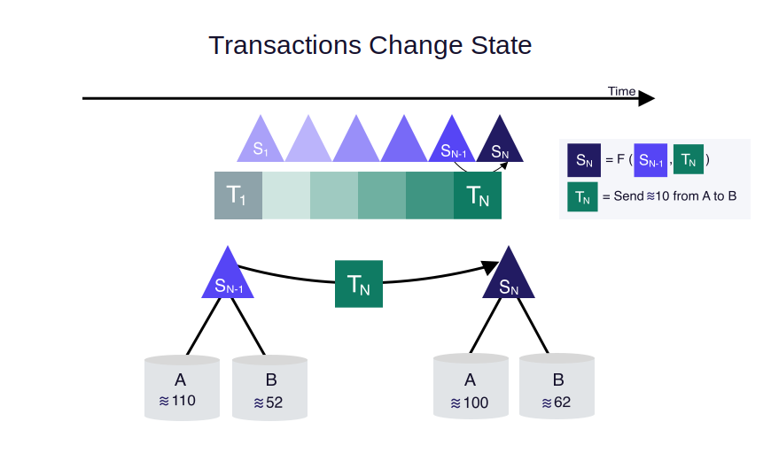

Libra区块链是一个加密认证的分布式数据库，它基于Libra协议。本文简要介绍libra协议的关键概念。有关Libra协议所有元素的详细说明，请参阅[Libra区块链技术论文](https://libra.org/en-us/whitepaper).

Libra区块链由[验证节点](reference/glossary.md#validator-node)的分布式网络维护，也称为验证者。验证者集体遵循[一致性协议](reference/glossary.md#consensus-protocol)来商定区块链中交易的顺序。

Libra测试网络是Libra区块链软件的早期原型 —— Libra Core的演示。

## 交易与状态(Transactions and States)

Libra协议的核心是两个基础概念 &mdash; 交易和状态。在任何一个时间点，区块链都有一个状态，状态(或称为账本状态)代表当前的链上数据的快照。执行一个交易会改变区块链的状态。

<small class="figure">图1.1 交易改变状态</small>

图1.1表示执行交易时发生的Libra区块链的状态变化。例如，在状态S~N-1~下，Alice的余额为110个Libra，Bob的余额为52个Libra。 将交易应用于区块链时，它将生成一个新状态。为了从S~N-1~过渡到S~N~，在状态S~N-1~之上执行了交易T~N~。这会导致Alice的余额减少10个Libra，而Bob的余额增加10个Libra。现在，新状态S~N~显示这些更新的余额。在图1.1中：

* **A** 和 **B** 分别表示Alice和Bob在区块链中的账户。
* **S~N-1~** 代表在区块链中的第 (N-1)^th^ 的状态。
* **T~N~** 是指在区块链上执行的第 n-th 个交易。
    * 在该例子中, T~N~ 是指 - “从用户A的账户转账10个Libra币到用户B的账户。”
* **F** 是一个确定性的函数。对于特定的初始状态和特定的交易，F始终返回相同的最终状态。如果区块链的当前状态为S~N-1~，并且交易T~N~在状态S~N-1~上执行，则区块链的新状态始终为S~N~。
* **S~N~**是区块链的第n个状态。S~N~是将F应用于S~N-1~和T~N~的结果。

Libra协议使用[Move语言](move-overview.md)来执行确定性函数F.

### 交易(Transactions)

Libra区块链的用户通过提交一个交易请求来更新账本状态，区块链上已签名的交易包括如下内容：

* **发送地址** &mdash; 交易发送者的账户地址。
* **发送者的公钥** &mdash; 与对交易进行签名的私钥相对应的公钥。
* **程序** &mdash; 该程序由如下部分组成：
    * Move字节码。
    * 可选的脚本输入列表。对于点对点交易，输入包含有关接收者和转移到接收者的金额的信息。
    * 可选的将要发布的Move字节码模块。
* **Gas 价格** (in microlibra/gas units) &mdash; 发送方愿意为执行交易而每[燃料](reference/glossary.md#gas)支付的金额。燃料是一种支付计算和存储费用的方式。 气体单位是对计算的抽象度量，没有固有的实际值。
* **最大燃料总量** &mdash; 交易允许消费的最大燃料量。 
* **序列号** &mdash; 一个正整数，等于发送者账户中的序列号。
* **超时时间** &mdash; 交易保持有效的超时时间。
* **签名** &mdash; 发送者的数字签名。

交易脚本可以是任意的程序，该程序编码了交易逻辑，与发布在Libra区块链上的分布式数据库中的资源进行交互。

### 账本状态(Ledger State)

账本状态或Libra区块链的全局状态由区块链中所有帐户的状态组成。为了执行交易，每个验证者必须知道最新版本的区块链分布式数据库的全局状态。请参见[版本化数据库](#versioned-database)。

## 版本化数据库(Versioned Database)

Libra区块链中的所有数据都保存在单版本的分布式数据库中。版本号是一个无符号的64位整数，与系统已执行的交易数相对应。

版本化数据库允许验证者执行以下操作：

* 在最新版本的账本状态下执行事务。
* 响应客户有关当前和以前版本分类帐历史记录的查询。

## 账户(Account)

Libra帐户是Move模块和Move资源的容器。它由[帐户地址](reference/glossary.md#account-address)标识。 这实质上意味着每个帐户的状态都由代码和数据组成：

* [Move模块](move-overview.md#move-modules-allow-composable-smart-contracts)**包含代码（类型和过程声明），但不包含数据。模块的过程对用于更新区块链全局状态的规则进行编码。
* [移动资源](move-overview.md#move-has-first-class-resources)**包含数据但不包含代码。 每个资源值都有在区块链分布式数据库中发布的模块中声明的类型。

一个帐户可以包含任意数量的Move资源和Move模块。

#### 账户地址(Account Address)

Libra帐户地址的长度为256比特。 用户可以将数字签名声明为地址。 帐户地址是用户的公共验证码的加密哈希。 要签署从其帐户地址发送的交易，用户（或代表该用户的托管客户端）必须使用与该帐户相对应的私钥。

Libra用户可以声明的地址数量没有限制。 要声明帐户地址，应从拥有足够Libra的帐户发送交易以支付帐户创建费用。

## 证据(Proof)

Libra区块链中的所有数据都存储在一个单版本的分布式数据库中。该存储用于持久存储已共识的区块及其执行结果。区块链被表示为不断增长的[交易的默克尔树](reference/glossary.md#merkle-trees)。对于在区块链上执行的每笔交易，被作为“叶子”附加到树上。

* 证明是一种验证天秤座区块链中数据真实性的方法。
* 存储在区块链上的每个操作都可以进行密码学验证，所得证明还证明没有数据被遗漏。例如，如果客户从一个帐户中查询了最新的 _n_ 个交易，则证明将验证查询响应中没有遗漏任何交易。

在区块链中，客户端不需要信任从其接收数据的实体。客户可以查询帐户余额，询问是否处理了特定交易，等等。与其他Merkle树一样，分类帐历史记录可以提供特定交易对象的$O(\log n)$大小的证明，其中 _n_ 是已处理交易的总数。

## 验证者节点（Validator）

Libra区块链的客户创建交易并将其提交到验证者节点。 验证者节点运行共识协议（与其他验证者节点一起），执行交易，并将交易和执行结果存储在区块链中。 验证者节点决定将哪些交易添加到区块链中，并以什么顺序添加。
<small class="figure">Figure 1.2 验证器的逻辑组件</small>

验证器节点包含以下逻辑组件：

**准入控制（AC）**

* 准入控制组件（AC）是验证者节点的唯一外部接口。 客户端对验证者节点的任何请求都首先转到AC。
* AC对请求执行初始检查，以保护验证器节点的其他部分不受损坏或过高输入流量的影响。

**内存池（Mempool）**

* 内存池是一个缓冲区，其中包含“正在等待”执行的事务。
* 当新交易添加到验证者节点的内存池时，此验证者节点的内存池与系统中其他验证者的内存池共享此事务。

**共识（Consensus）**

* 共识组件负责通过与网络中的其他验证者节点一起参与[共识协议](reference/glossary.md#consensus) 来对交易块进行排序并就执行结果达成一致。

**执行（Execution）**

* 执行组件使用虚拟机组件（VM）执行交易。
* 执行组件的工作是协调一系列（块）交易的执行，并保持可以通过共识投票的暂时状态。
* 执行组件保持执行结果的内存表示形式，直到共识将块提交给分布式数据库为止。

**虚拟机（VM）**

* 准入控制组件和内存池组件使用虚拟机组件执行交易有效性验证。 
* 虚拟机组件用于运行交易中包含的程序并确定结果。

**存储（Storage）**

存储组件用于持久存储已经达成共识的区块和其中所有交易的执行结果。

有关每个验证器组件与其他组件的交互的信息，请参阅[交易的生命周期](life-of-a-transaction.md).

## 参考资料

* [欢迎页](welcome-to-libra.md).
* [我的第一笔交易](my-first-transaction.md) &mdash; 指导您使用Libra命令行客户端在Libra上执行您的第一笔交易。
* [Move入门](move-overview.md) &mdash; 向您介绍一种称为Move的新区块链编程语言。
* [交易的生命周期](life-of-a-transaction.md) &mdash; 提供提交和执行事务时“幕后”发生的情况。
* [Libra核心概览](libra-core-overview.md) &mdash; 通过README文件提供Libra核心组件的概念和实现细节。
* [命令行指导](reference/libra-cli.md) &mdash; 列出Libra客户端的命令（及其用法）。
* [Libra术语表](reference/glossary.md) &mdash; 提供Libra术语的快速参考。
