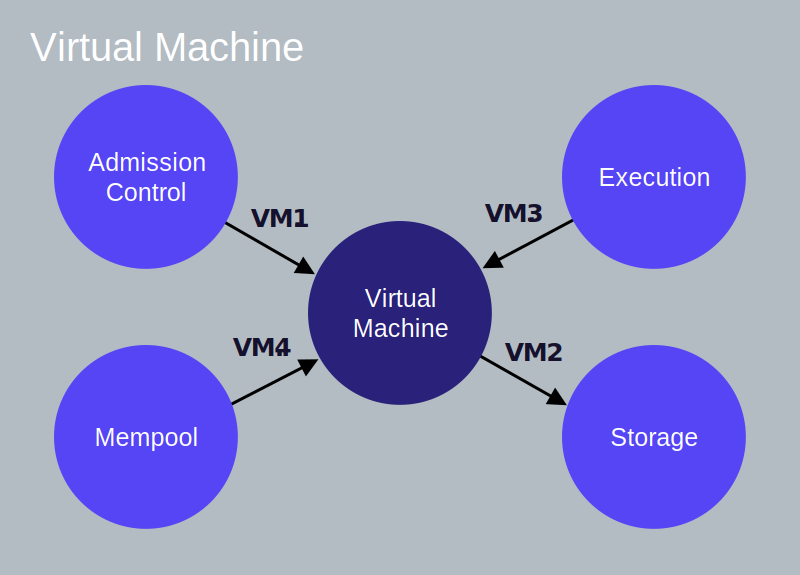

为了更深入地了解Libra交易的生命周期，我们将跟踪交易从提交到Libra验证程序到提交给Libra区块链的整个过程。 然后，我们将“放大”验证器的每个逻辑组件，并查看其与其他组件的交互。

## 客户端提交一笔交易

**一个Libra客户端构建了一个原始交易** (让我们称之为 T~5~raw)，该交易从Alice的账户中转出10 Libra到Bob的账户中。其包含如下字段，每个字段都链接了它的词汇定义。

* Alice的[账户地址](reference/glossary.md#account-address).
* 一个程序，指示代表Alice执行的操作。它包含：
    * Move程序的字节码[p2p交易脚本](reference/glossary.md#transaction-script)。
    * 脚本输入参数列表（例如，Bob的帐户地址和付款金额）。
    
* [燃料价格](reference/glossary.md#gas-price) (以 microlibra/gas 为单位) &mdash; Alice愿意为每单位燃料支付的金额，以执行交易。燃料是一种支付计算和存储费用的方式。gas是计算的抽象单位，与真实世界中的燃料无关。
* Alice愿意为此交易支付的[最大燃料量](reference/glossary.md#maximum-gas-amount)。
* 交易的[超时时间](reference/glossary.md#expiration-time)。
* [交易序列号](reference/glossary.md#sequence-number) &mdash; 5
    * 该交易序列号与Alice的账号地址的组合在系统中是唯一的，并且单调递增。

客户端用Alice的私钥**对交易T~5~raw进行签名**。签名交易T~5~包括以下内容：

* 原始交易。
* Alice的公钥。
* Alice的签名。

### 前提假设

为了描述交易 T~5~ 的生命周期，我们假设：

* Alice和Bob在Libra区块链上已经拥有[账户](reference/glossary.md#accounts)。
* Alice的账户中有110个Libra币。
* Alice账户当前的[交易序列号](reference/glossary.md#sequence-number)等于5(表明Alice账户中已经发送了5笔交易)。
* 总共有100个验证器 &mdash; 从V~1~到V~100~。
* 客户端将交易T~5~提交给验证器V~1~
* **验证器V~1~是本轮潜在的提议者/领导者。**

## 交易的生命周期

在本节中，我们将描述交易T~5~的生命周期，从客户端提交到最终写入到Libra区块链。

在相关的地方，并按照生命周期中的编号步骤进行操作，我们提供了指向验证器节点的相应组件间交互的链接。 熟悉交易生命周期中的所有步骤之后，您可能希望参考有关每个步骤的组件间交互的信息。

<blockquote class="block_note">
**注意：**本文档中所有图形中的箭头起源于启动交互/动作的组件，并终止于在其上执行动作的组件。 箭头**不表示**读取，写入或返回的数据。
</blockquote>

<small class="figure">Figure 1.1 交易的生命周期</small>

### 接受交易

**1** &mdash; 客户端将交易T~5~提交给验证器V~1~，由其准入控制组件(AC)处理该交易。(Client → AC [AC.1](#client-ac-ac1))

**2** &mdash; 准入控制组件(AC)将使用虚拟机（VM）组件执行合法性检查， 例如签名校验，检查Alice的帐户是否有足够的余额，确保交易T~5~未重放等。(AC → VM [AC.2](#ac-vm-ac2), [VM.1](#ac-vm-vm1))

**3** &mdash; 当T~5~通过验证检查时，准入控制组件(AC)将T~5~发送到V~1~的内存池组件。(AC → Mempool [AC.3](#ac-mempool-ac3), [MP.1](#ac-mempool-mp1))

### 与其他验证者共享交易（Sharing the Transaction With Other Validators）

**4** &mdash; 内存池组件会将T~5~保留在内存缓冲区中。 内存池组件中可能已经包含多个从Alice的地址发送的交易。

**5** &mdash; 使用共享内存池协议，V~1~将在其内存池中与其他验证器（V~2~到V~100~）共享交易（包括T~5~）。并将从其他验证器收到的交易放入其自己的内存池。(Mempool → Other Validators [MP.2](#mempool-other-validators-mp2))

### 提名区块（Proposing the Block）

**6** &mdash; 由于验证者V~1~是提议者/领导者，它将从其内存池中提取一个区块，并通过其共识组件将该块形成为提议并复制到其他验证器中。(共识 → 内存池 [MP.3](#consensus-mempool-mp3), [CO.1](#consensus-mempool-co1))

**7** &mdash; V~1~的共识组件负责协调所有验证器之间关于拟议区块中交易顺序的协议。(Consensus → Other Validators [CO.2](#consensus-other-validators-co2)). 有关我们提议的共识协议LibraBFT的详细信息，请参阅我们的技术论文[Libra区块链中的状态机复制](state-machine-replication-paper.md)。

### 执行区块并达成共识（Executing the Block and Reaching Consensus）

**8** &mdash; 作为达成协议的一部分，区块（包含T~5~）被传递给执行组件。 (Consensus → Execution [CO.3](#consensus-execution-consensus-other-validators-co3), [EX.1](#consensus-execution-ex1))

**9** &mdash; 执行组件管理虚拟机（VM）中的交易的执行。请注意，在块中的交易已经达成一致之前进行的推测性执行。(Execution → VM [EX.2](#execution-vm-ex2), [VM.3](#execution-vm-vm3))

**10** &mdash; 在执行块中的交易之后，执行组件将块中的交易（包括T~5~）附加到[默克尔累加器](#merkle-accumulators)（帐本历史记录）中。这是默克尔累加器的内存/临时版本。执行这些交易的（提议/推测）结果返回到共识组件。 (Consensus → Execution [CO.3](#consensus-execution-consensus-other-validators-co3), [EX.1](#consensus-execution-ex1)). 从“consensus”到“execution”的箭头表示执行交易的请求是由共识组件完成的。 （为了在本文档中一致使用箭头，我们不使用箭头来表示数据流）。

**11** &mdash; V~1~（共识领导者）试图与参与共识的其他验证者就该区块的执行结果达成共识。 (Consensus → Other Validators [CO.3](#consensus-execution-consensus-other-validators-co3))

### 提交区块（Committing the Block）

**12** &mdash; 如果块的执行结果获得超过多数票的验证器达成一致并签名，则验证器V~1~的执行组件从推测性的执行缓存中读取块的执行结果并提交块中的所有交易到持久存储。(Consensus → Execution [CO.4](#consensus-execution-co4), [EX.3](#consensus-execution-ex3)), (Execution → Storage [EX.4](#execution-storage-ex4), [ST.3](#execution-storage-st3))

**13** &mdash; Alice的账号现在有100个Libra币，其交易序列号为6。如果由Bob重播T~5~，则由于Alice的账号的序列号（6）大于重放交易的序列号（5）而被拒绝。

## 验证者内部组件之间的交互（Validator Component Interactions）

在[上一节](#lifecycle-of-the-transaction)中，我们描述了从提交到写入到区块链的示例交易的典型生命周期。现在让我们更深入地了解验证器的组件间交互，因为验证器处理交易并响应查询。这些信息对以下人员最有用：

* 希望全面了解系统如何在幕后工作。
* 有兴趣最终为Libra Core项目做出贡献。

对于我们的叙述，我们假设客户端将一个交易T~N~提交给验证器V~X~。对于每个验证器组件，我们将在相应组件部分下的子部分中描述其每个组件间交互。请注意，描述组件间交互的子部分未严格按其执行顺序列出。大多数交互与交易处理相关，少数与客户端读取查询相关（查询区块链上的现有信息）。

让我们看一下验证器节点的核心逻辑组件：

* [准入控制(Admission Control)](#admission-control-ac)
* [内存池(Mempool)](#mempool)
* [共识(Consensus)](#consensus)
* [执行(Execution)](#execution)
* [虚拟机(Virtual Machine)](#virtual-machine-vm)
* [存储(Storage)](#storage)

在每个部分的末尾，我们提供了[Libra Core](libra-core-overview.md)的相应"自述"文件的链接。

## 准入控制 Admission Control (AC)

<small class="figure">Figure 1.2 准入控制</small>

准入控制组件（AC）是验证器的唯一外部接口。客户端向验证器发出的任何请求都会先转到AC。

### 客户端 → 准入控制 (AC.1)

客户端将交易提交给验证器V~X~的准入控制组件。这通过以下函数完成：
`AC::SubmitTransaction()`.

### 准入控制 → 虚拟机 (AC.2)

准入控制组件访问验证器的虚拟机（VM）以对交易执行初步检查，以便尽早拒绝格式错误的交易。这通过调用如下函数完成：
 [`VM::ValidateTransaction()`](#virtual-machine-b).

### 准入控制 → 内存池 (AC.3)

一旦`VM::ValidateTransaction()`返回没有错误，准入控制组件通过将交易转发给验证器V~X~的内存池。只有当T~N~的序列号大于或等于发送者帐户的当前序列号时，验证器V~X~的内存池才从准入控制组件中接受交易T~N~（注意，在它是下一个序列号之前，交易不会被传递到共识组件）。

### 准入控制 → 存储 (AC.4)

当客户端在Libra区块链上执行读取查询（例如，为了获得Alice帐户的余额）时，准入控制组件直接与存储组件交互以获取所请求的信息。

### 准入控制自述文件

有关实现细节，请参阅[准入控制组件自述](crates/admission-control.md)。

## 虚拟机组件(VM)

<small class="figure">Figure 1.3 虚拟机组件</small>

[Move virtual machine](move-overview.md) (VM)验证并执行以Move字节码编码的交易脚本。

### 准入控制 → 虚拟机 (VM.1)

当验证器V~X~的许可控制组件从客户端接收交易时，它在虚拟机组件上调用 `VM::ValidateTransaction()` 来验证交易。

### 虚拟机 → 存储 (VM.2)

当准入控制组件或内存池组件请求虚拟机组件通过 `VM::ValidateTransaction()` 验证交易时，虚拟机组件从存储组件加载交易发送者的帐户并执行以下验证：

* 检查签名交易上的输入签名是否正确（以拒绝错误签名的交易）。
* 检查发件人的帐户身份验证密钥是否与公钥的哈希相同（对应于用于签署交易的私钥）。
* 验证交易的序列号是否不小于发件人帐户的当前序列号。执行此检查可防止针对发件人帐户重播同一交易。
* 验证已签名交易中的程序是否格式错误，因为虚拟机组件无法执行格式错误的程序。
* 验证发件人帐户中是否有足够的余额来支持交易中指定的最大燃料量，从而确保交易可以支付其使用的资源。

### 执行 → 虚拟机 (VM.3)

执行组件利用虚拟机组件通过 `VM::ExecuteTransaction()` 执行交易。

重要的是要理解执行交易不同于更新分类帐的状态并将结果保存至永久存储中。执行交易T~N~首先被执行组件作为在共识期间达成关于块的协议的尝试的一部分。如果与其他验证者就交易顺序及其执行结果达成协商一致，则结果将保留在存储中，并更新分类帐的状态。

### 内存池 → 虚拟机 (VM.4)

当内存池组件通过共享内存池数据的方式从其他验证器接收到一个交易时，内存池会在虚拟机组件上调用[`VM::ValidateTransaction()`](#action-b-1) 来验证交易。

### 虚拟机组件自述

有关实现的详细信息，请参阅[虚拟机组件自述](crates/vm.md)。

## 内存池组件

<small class="figure">Figure 1.4 内存池</small>

内存池是一个共享缓冲区，用于保存“等待”执行的交易。当新交易添加到内存池时，内存池与系统中的其他验证器共享此交易。为了减少“共享内存池”中的网络消耗，每个验证器负责将其自己的交易传递给其他验证器。当验证器从另一个验证器的内存池接收到一个交易时，该交易将被添加到收件人验证器的内存池中。

### 准入控制 → 内存池 (MP.1)

* 执行初始验证检查后，验证器的准入控制组件将交易发送到验证器的内存池。
* 仅当T~N~的交易序列号大于或等于发送者帐户的当前交易序列号时，验证者V~X~的内存池才接受发送者帐户的交易T~N~。

### 内存池 → 其他验证器 (MP.2)

* 验证器V~X~的内存池组件与同一网络上的其他验证器共享交易T~N~。
* 其他验证器将他们的内存池中的交易共享给V~X~的内存池。

### 共识 → 内存池 (MP.3)

* 当验证器V~X~成为领导者时，其共识将从其内存池中提取一个区块并将该块复制到其他验证器。这样做是为了就交易的排序和块中交易的执行结果达成共识。
* 注意，仅仅因为交易T~N~被包含在共识块中，它不能保证T~N~最终将被保留在区块链的分布式数据库中。

### 内存池 → 虚拟机 (MP.4)

当内存池组件从其他验证器接收到一个交易时，内存池会在虚拟机上调用[`VM::ValidateTransaction()`](#action-b-1)来验证交易。

### 内存池组件自述

有关实现的详细信息，请参阅[内存池组件自述](crates/mempool)。

## 共识组件(Consensus)

<small class="figure">Figure 1.5 Consensus</small>

共识组件负责对区块中的交易进行排序，并通过与网络中的其他验证器一起参与[共识协议](#consensus-protocol)来商定执行结果。

### 共识 → 内存池 (CO.1)

当验证器V~X~是潜在的领导者/提议者时，V~X~的共识从其内存池通过：`Mempool::GetBlock()` 获取一个区块，并形成一个提议。

### 共识 → 其他验证者 (CO.2)

如果V~X~是提议者/领导者，则其共识组件将提议的区块复制给其他验证器。

### 共识 → 执行, 共识 → 其他验证器 (CO.3)

* 为了执行一个区块，共识组件与执行组件交互。 共识组件通过`Execution:ExecuteBlock()`执行一个区块(参见[Consensus → Execution](#consensus-execution-ex1))。
* 执行区块中的交易后，执行组件将执行这些交易的结果返回给共识组件。
* 共识组件签署执行结果，并试图与参与共识协商的其他验证器就结果达成一致。

### 共识 → 执行 (CO.4)

如果足够多的验证器为相同的执行结果投票，则V~X~的共识组件通过`Execution::CommitBlock()`通知执行该块已准备好提交。

### 共识组件自述

有关实现细节，请参阅[共识组件自述](crates/consensus.md)。

## 执行组件(Execution) 

<small class="figure">Figure 1.6 Execution</small>

执行组件的工作是协调一个区块中所有交易的执行，并维持一个可以通过投票达成一致的过渡状态。

### 共识 → 执行 (EX.1)

* 共识组件请求执行组件调用如下方法执行区块：`Execution::ExecuteBlock()`。
* 执行组件会维护一个“暂存器”，它保存[默克尔累积器](#merkle-accumulators)相关部分的内存副本。此信息用于计算区块链当前状态的根哈希值。
* 当前状态的根哈希与有关块中交易的信息相结合，以确定累加器的最新根哈希值。这是在保留任何数据之前完成的，并确保在法定数量的验证者达成协议之前不会存储任何状态或交易。
* 执行计算推测的根哈希，然后V~X的共识组件签署此根哈希并尝试与其他验证器达成对此根哈希值的协商一致。

### 执行 → 虚拟机 (EX.2)

当共识组件请求执行组件通过`Execution::ExecuteBlock()`执行一个区块时，执行组件使用VM组件来确定执行区块的结果。

### 共识 → 执行 (EX.3)

如果法定数量的验证器同意区块执行结果，则每个验证器的共识组件通过`Execution::CommitBlock()`通知其执行组件该块已准备好提交。对执行组件的此调用将包括所有同意验证器的签名，以提供其协议的证明。

### 执行 → 存储 (EX.4)

执行组件从其“暂存器”获取值，并通过`Storage::SaveTransactions()`将它们发送到存储器以进行持久化。执行组件然后把不再需要的“暂存器”中的旧值删除（例如，无法提交的并行区块）。

### 执行组件自述

有关实现的详细信息，请参阅[执行组件自述](crates/execution)。

## 存储组件

<small class="figure">Figure 1.7 Storage</small>

存储组件持久化保存已经达成共识的交易块及其执行结果。在下列情况下，将通过存储保存一批或一组交易(包括交易 T~N~ )：

* 超过 2f+1 的验证人就以下所有方面达成一致达成共识：
    * 哪些交易会被包含在块中。
    * 交易的先后顺序。
    * 包含在块中的全部交易的执行结果。

有关如何将交易附加到表示区块链的数据结构的信息，请参阅[Merkle accumulators](reference/glossary.md#merkle-accumulators)。

### 虚拟机 → 存储 (ST.1)

当准入控制组件或内存池组件调用`VM::ValidateTransaction()`来验证交易时，`VM::ValidateTransaction()`从存储组件加载发送人的帐户并对交易执行只读有效性检查。

### 执行 → 存储 (ST.2)

当共识组件调用`Execution::ExecuteBlock()`时，执行组件从存储组件中读取结合了内存中的“暂存器”数据的当前状态来确定执行结果。

### 执行 → 存储 (ST.3)

* 一旦一个区块中的交易达成了共识，执行组件就会通过`Storage::SaveTransactions()`调用存储组件来保存区块并永久存储它们。同时还将存储来自同意此区块的验证器节点的签名。
* 此块的“暂存器”中的内存数据将传递到更新后的存储组件并持久化这些交易。
* 更新存储组件时，每个交易修改的所有资源的序列号都会相应更新。
* 注意：对于源自该帐户的每个已提交交易，Libra区块链上的帐户序列号递增1。

### 准入控制 → 存储 (ST.4)

对于从区块链读取信息的客户端查询请求，准入控制组件直接与存储组件交互以读取所请求的信息。

### 存储组件自述

有关实现的详细信息，请参阅[存储组件自述](crates/storage.md)。

## 参考资料

* [欢迎页](welcome-to-libra.md).
* [Libra协议: 核心概念](libra-protocol.md) &mdash; 介绍Libra协议的基础概念。
* [我的第一笔交易](my-first-transaction.md) &mdash; 指导您使用Libra命令行客户端在Libra上执行您的第一笔交易。
* [Move入门](move-overview.md) &mdash; 向您介绍一种称为Move的新区块链编程语言。
* [Libra核心概览](libra-core-overview.md) &mdash; 通过README文件提供Libra核心组件的概念和实现细节。
* [命令行指导](reference/libra-cli.md) &mdash; 列出Libra客户端的命令（及其用法）。
* [Libra术语表](reference/glossary.md) &mdash; 提供Libra术语的快速参考。
* [Libra区块链的复制状态机](state-machine-replication-paper.md) &mdash; 详细介绍了Libra的共识协议**LibraBFT**。

