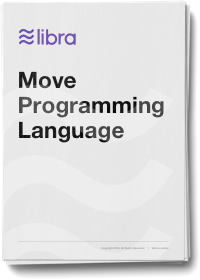

<!-- hide the table of contents -->

## 概要

我们介绍了*Move*，这是一种适用于Libra区块链的安全灵活的编程语言。Move是一种可执行的字节码语言，用于实现自定义交易和智能合约。Move的主要功能是能够使用线性逻辑启发的语义定义自定义*资源类型*：永远不能复制或隐式丢弃资源，只能在程序存储位置之间移动资源。这些安全保证由Move的类型系统静态实施。尽管有这些特殊保护，资源还是普通的程序值 - 它们可以存储在数据结构中，作为参数传递给过程，依此类推。一流的资源是一个非常笼统的概念，程序员不仅可以使用它来实现安全的数字资产，而且可以编写正确的业务逻辑来包装资产和执行访问控制策略。Move的安全性和表达能力使我们能够在Move中实现Libra协议的重要部分，包括Libra币，交易处理和验证器管理。

### 下载链接

[{: .download}](assets/papers/libra-move-a-language-with-programmable-resources.pdf)
