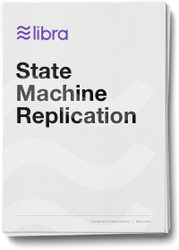

<!-- hide the table of contents -->

## 概要

本报告介绍了LibraBFT，这是专为Libra区块链设计的强大而高效的状态机复制系统。LibraBFT基于HotStuff，HotStuff是一种新的协议，它利用了拜占庭式容错（BFT）数十年的科学进展，并实现了Internet设置所需的强大可伸缩性和安全性。LibraBFT进一步完善了HotStuff协议，引入了明确的活动机制，并提供了具体的延迟分析。为了推动与Libra区块链的集成，本文档提供了从功能齐全的模拟器中提取的规范。这些规范包括状态复制接口和用于参与者之间的数据传输和状态同步的通信框架。最后，该报告提供了正式的安全证明，可引诱标准来检测BFT节点的不良行为，并具有简单的奖惩机制。

### 下载链接

[{: .download}](assets/papers/libra-consensus-state-machine-replication-in-the-libra-blockchain.pdf)
