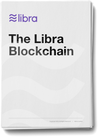

<!-- hide the table of contents -->

## 概要

Libra区块链是一个非中心化的，可编程的数据库，旨在支持低波动性的加密货币，它将有能力成为全球数十亿人的高效交易媒介。我们提出一项有关Libra协议的提案，该提案实施了Libra区块链，旨在创建可促进创新，降低准入门槛并改善获得金融服务机会的金融基础设施。为了验证Libra协议的设计，我们已经构建了一个开放源代码的原型实现 *L​​ibra核心* 期望在全球范围内共同努力以推进这一新生态系统。

Libra协议允许来自不同机构的一组副本（称为验证者/验证器）共同维护可编程资源的数据库。这些资源由通过公用密钥密码认证的不同用户帐户拥有，并遵守这些资源的开发人员指定的自定义规则。验证程序处理事务并相互交互以就数据库状态达成共识。事务基于一种称为*Move*的新编程语言，基于预定义的以及将来版本中的用户定义的智能合约。

我们使用Move来定义区块链的核心机制，例如货币和验证者成员资格。这些核心机制可以创建一个独特的治理机制，该机制建立在早期机构现有机构的稳定性和声誉基础之上，但随着时间的推移过渡到完全开放的系统。

### 下载链接

[{: .download}](assets/papers/the-libra-blockchain.pdf)
